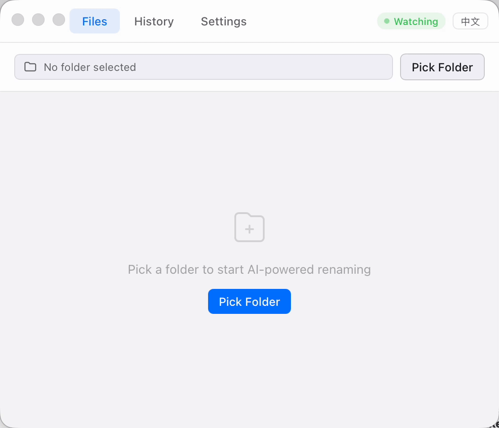
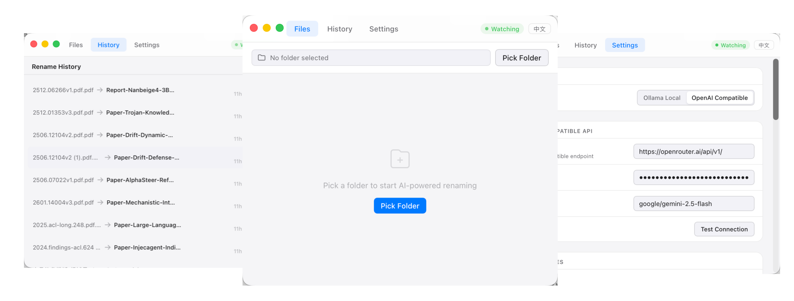

<div align="center">
  
  <p><strong>Smart file renaming, powered by AI.</strong><br>Drag files in, get meaningful names out.</p>

  <p>
    <a href="https://github.com/Syuchin/Fyla/releases"></a>
    <a href="https://github.com/Syuchin/Fyla/blob/main/LICENSE"></a>
    <a href="https://github.com/Syuchin/Fyla"></a>
    <a href="https://github.com/Syuchin/Fyla/releases"></a>
  </p>

  <p>
    <a href="./README_CN.md">中文</a> ·
    <a href="https://github.com/Syuchin/Fyla/releases">Download</a> ·
    <a href="https://github.com/Syuchin/Fyla/issues">Report Bug</a>
  </p>

  
  <br><br>
  
</div>

## Features

- **AI rename** -- uses LLMs to read your files and generate descriptive filenames
- **Local-first** -- works with [Ollama](https://ollama.com) for fully offline renaming. Files never leave your machine
- **Cloud-ready** -- also supports any OpenAI-compatible API (OpenAI, DeepSeek, Groq, etc.)
- **Text extraction** -- reads content from PDF, DOCX, PPTX, XLSX, and plain text files
- **Image understanding** -- OCR via macOS Vision framework, EXIF metadata, and optional VLM support for multimodal models
- **Folder watching** -- monitor a folder and auto-rename new files as they appear
- **Finder integration** -- right-click files in Finder and send them to Fyla via macOS Services
- **Batch rename** -- process multiple files at once with streaming progress
- **Undo** -- full rename history with one-click revert
- **Naming templates** -- customize output format with `{type}`, `{title}`, `{date}`, `{author}` variables
- **Naming styles** -- kebab-case, camelCase, PascalCase, snake_case, Train-Case
- **Lightweight** -- ~8MB binary, low memory usage. Built with Tauri + Rust, not Electron

## Install

### Download

Grab the `.dmg` from [GitHub Releases](https://github.com/Syuchin/Fyla/releases).

> Requires macOS 13.0+. The app is ad-hoc signed (no Apple Developer certificate), so you may need to right-click > Open on first launch.

### Build from Source

Prerequisites:
- [Rust](https://rustup.rs/) (stable)
- [Node.js](https://nodejs.org/) (v18+)
- Xcode Command Line Tools (`xcode-select --install`)

```bash
git clone https://github.com/Syuchin/Fyla.git
cd fyla
npm install
npm run tauri build
```

The `.dmg` will be in `src-tauri/target/release/bundle/dmg/`.

## Configuration

Open Settings from the tray icon menu.

### Ollama (local, offline)

1. Install and run [Ollama](https://ollama.com)
2. Pull a model: `ollama pull llama3.2`
3. In Fyla settings, select **Ollama** as provider
4. Default URL is `http://localhost:11434` -- change if needed
5. Set the model name to match what you pulled

### OpenAI-compatible API

1. Select **OpenAI** as provider
2. Enter your API key
3. Set the base URL (default: `https://api.openai.com/v1`)
   - For DeepSeek: `https://api.deepseek.com/v1`
   - For Groq: `https://api.groq.com/openai/v1`
4. Set model name (e.g. `gpt-4o-mini`, `deepseek-chat`)

### VLM (Vision Language Models)

For image files, you can enable VLM to use multimodal models that actually "see" the image instead of relying on OCR text alone. Works with Ollama vision models (e.g. `llava`) or cloud APIs that support image inputs.

## Tech Stack

- **Backend**: Rust, Tauri v2
- **Frontend**: Preact, Vite
- **OCR**: macOS Vision framework (via native C bridge)
- **File parsing**: pdf-extract, calamine, quick-xml, zip
- **macOS native**: window vibrancy, tray icon, NSServices, FSEvents

## Contributing

Issues and PRs welcome. See the [issue tracker](https://github.com/Syuchin/Fyla/issues).

## License

[MIT](LICENSE)
